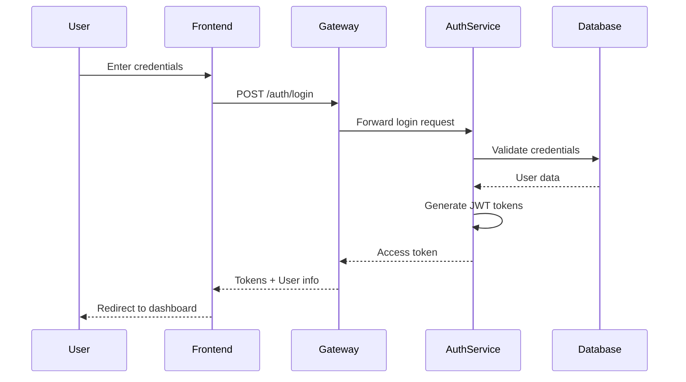
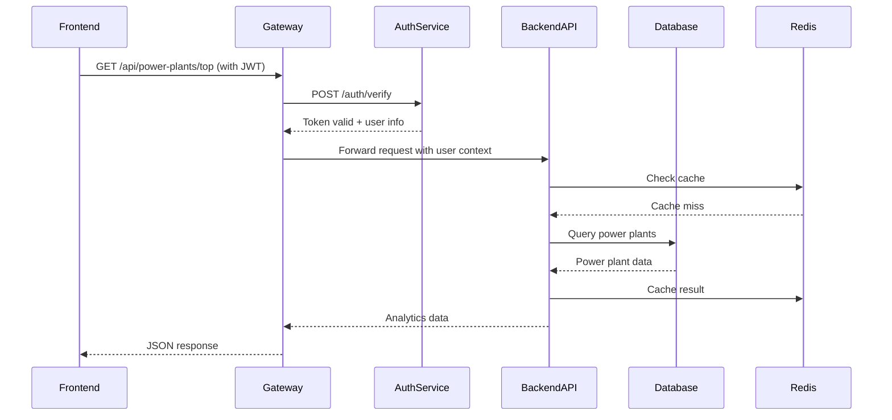
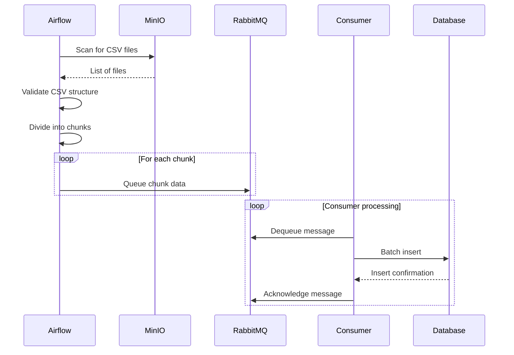
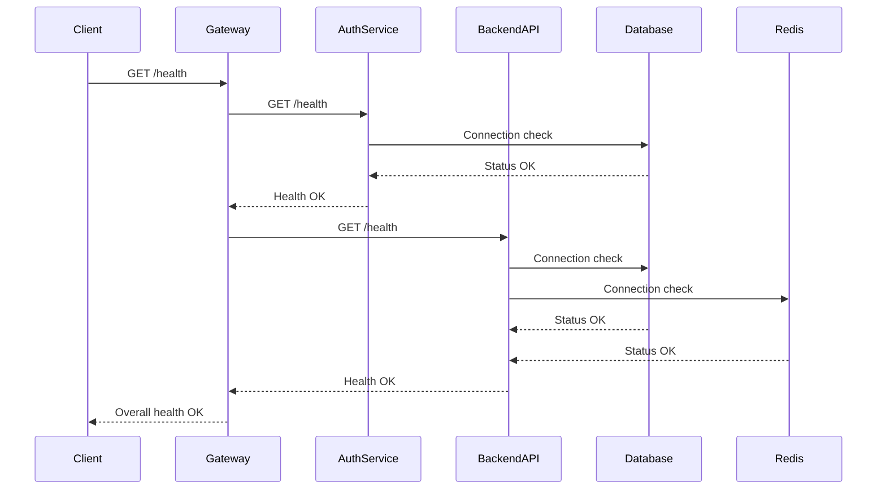

# API Sequence Diagrams

## 1. User Authentication Flow

```mermaid
sequenceDiagram
    participant User
    participant Frontend
    participant Gateway
    participant AuthService
    participant Database

    User->>Frontend: Enter credentials
    Frontend->>Gateway: POST /auth/login
    Gateway->>AuthService: Forward login request
    AuthService->>Database: Validate credentials
    Database-->>AuthService: User data
    AuthService->>AuthService: Generate JWT tokens
    AuthService-->>Gateway: Access token
    Gateway-->>Frontend: Tokens + User info
    Frontend-->>User: Redirect to dashboard
```

## 2. Protected API Request Flow

```mermaid
sequenceDiagram
    participant Frontend
    participant Gateway
    participant AuthService
    participant BackendAPI
    participant Database
    participant Redis

    Frontend->>Gateway: GET /api/power-plants/top (with JWT)
    Gateway->>AuthService: POST /auth/verify
    AuthService-->>Gateway: Token valid + user info
    Gateway->>BackendAPI: Forward request with user context
    BackendAPI->>Redis: Check cache
    Redis-->>BackendAPI: Cache miss
    BackendAPI->>Database: Query power plants
    Database-->>BackendAPI: Power plant data
    BackendAPI->>Redis: Cache result
    BackendAPI-->>Gateway: Analytics data
    Gateway-->>Frontend: JSON response
```

## 3. Data Ingestion Flow

```mermaid
sequenceDiagram
    participant Airflow
    participant MinIO
    participant RabbitMQ
    participant Consumer
    participant Database

    Airflow->>MinIO: Scan for CSV files
    MinIO-->>Airflow: List of files
    Airflow->>Airflow: Validate CSV structure
    Airflow->>Airflow: Divide into chunks
    loop For each chunk
        Airflow->>RabbitMQ: Queue chunk data
    end
    
    loop Consumer processing
        Consumer->>RabbitMQ: Dequeue message
        Consumer->>Database: Batch insert
        Database-->>Consumer: Insert confirmation
        Consumer->>RabbitMQ: Acknowledge message
    end
```

## 4. Health Check Flow

```mermaid
sequenceDiagram
    participant Client
    participant Gateway
    participant AuthService
    participant BackendAPI
    participant Database
    participant Redis

    Client->>Gateway: GET /health
    Gateway->>AuthService: GET /health
    AuthService->>Database: Connection check
    Database-->>AuthService: Status OK
    AuthService-->>Gateway: Health OK
    
    Gateway->>BackendAPI: GET /health
    BackendAPI->>Database: Connection check
    BackendAPI->>Redis: Connection check
    Database-->>BackendAPI: Status OK
    Redis-->>BackendAPI: Status OK
    BackendAPI-->>Gateway: Health OK
    
    Gateway-->>Client: Overall health OK
``` 